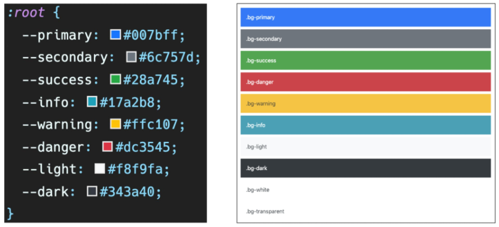
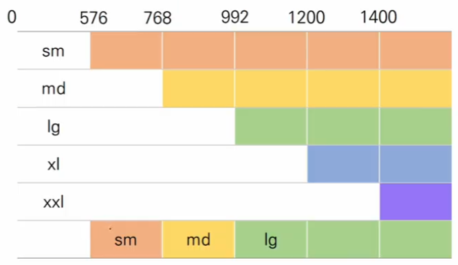

#### 1. sapcing

| class name | rem  | px   |
| ---------- | ---- | ---- |
| m-1        | 0.25 | 4    |
| m-2        | 0.5  | 8    |
| m-3        | 1    | 16   |
| m-4        | 1.5  | 24   |
| m-5        | 3    | 48   |

```
m : margin
p : padding

t : top
b : bottom
s : left
e : right
x : left, right
y : top, bottom

0 : 0 rem : 0px
1 : 0.25 rem : 4px
2 : 0.5 rem : 8px
3 : 1 rem : 16px
4 : 1.5 rem : 24px
5 : 3 rem : 48px
```


#### 2. color




#### 3.  Breakpoint

| Breakpoint        | Class infix | Dimensins  |
| ----------------- | ----------- | ---------- |
| X-Small           | `None`      | < 576 px   |
| Small             | `sm`        | >= 576 px  |
| Medium            | `md`        | >= 768 px  |
| Large             | `lg`        | >= 992 px  |
| Extra latge       | `xl`        | >= 1200 px |
| Extra extra large | `xxl`       | >= 1400 px |

