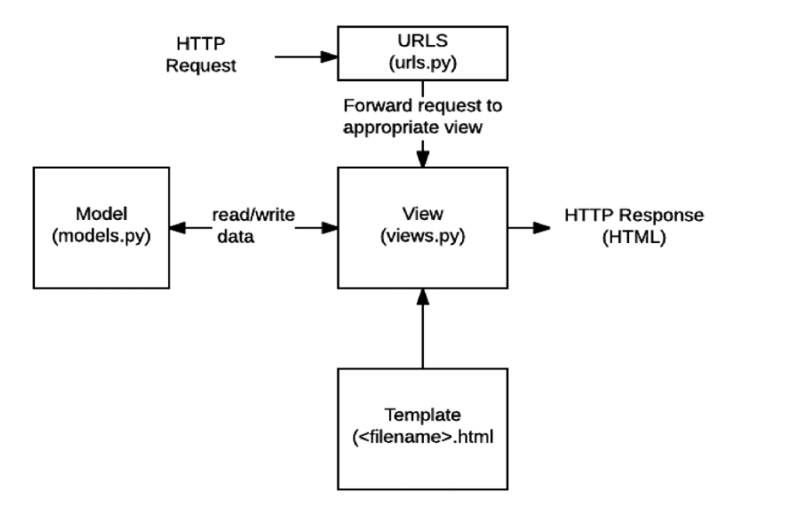

# Web : World Wide Web

1. **Static web page** (정적 웹 페이지)
   - 서버에 미리 저장된 파일이 사용자에게 그대로 전달되는 웹 페이지
   - 서버가 정적 웹 페이지에 대한 요청을 받은 경우 서버는 추가적인 처리 과정 없이 클라리언트에게 응답
   - **모든 상황에서 모든 사용자에게 동일한 정보를 표시**
   - 일반적으로 HTML, CSS, JavaScript 로 작성됨
   - flat page

2. **Dynamic web page** (동적 웹 페이지)

   - 웹페이지에 대한 요청을 받은 경우 서버는 추가적인 처리 과정 이후 클라이언트에게 응답

   - **방문자와 상호작용하기 때문에 페이지 내용은 그때그때 다름**

   - 서버 사이드 프로그래밍언어(Python, Java, C++ 등)가 사용, 파일을 처리하고 데이터베이스와의 상호작용

3. **Framework**

   - 프로그래밍에서 특정 운영 체제를 위한 응용 프로그램 표준 구조를 구현하는 **클래스와 라이브러리 모임**
   - **재사용할 수 있는 수많은 코드**를 프레임워크로 통합함으로써 개발자가 새로운 애플리케이션을 위한 표준 코드를 다시 작성하지 않아도 같이 사용할 수 있도록 도움
   - Application framework

## Framework Architecture

- MVC Design Pattern (model - view - controller)

- 사용자 인터페이스로부터 프로그램 로직을 분리하여 애플리케이션의 시각적 요소나 이면에서 실행되는 부분을 서로 영향 없이 쉽게 고칠 수 있는 애플리케이션을 만들 수 있음

  

- **MTV Pattern** (Django)

  - Model

    - 응용프로그램의 데이터 구조를 정의, 데이터베이스의 기록을 관리(추가, 수정, 삭제)

  - Template

    - 파일의 구조나 레이아웃을 정의, 실제 내용을 보여주는 데 사용(presentation)

  - **View**

    - HTTP 요청을 수신하고 HTTP 응답을 변환
    - Model을 통해 요청을 충족시키는데 필요한 데이터에 접근
    - template에게 응담의 서식 설정을 맡김		

    