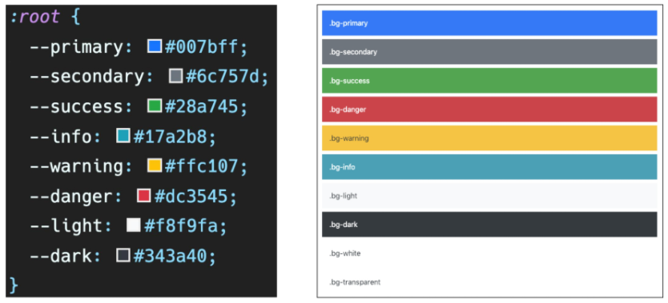

# web

## HTML (Hyper Text  Markup Language)

- HTML 문서의 기본구조 (! + tab)

  ```
  <!DOCTYPE html>  # 문서의 최상위(root) 요소
  <html lang="en">
  <head>  # 문서 메타데이터 요소 (문서제목, 인코딩, 스타일, 외부 파일 로딩 등)
    <meta charset="UTF-8">
    <meta http-equiv="X-UA-Compatible" content="IE=edge">
    <meta name="viewport" content="width=device-width, initial-scale=1.0">
    <title>Document</title>  # 브라우저 상단 타이틀
  </head>
  <body>  # 문서 본문 요소
    
  </body>
  </html>
  ```

  

- DOM (Document Object Model)

  - 텍스트 파일인 HTML 문서를 브라우저에서 렌더링 하기 위한 구조

  

- 시맨틱 태그

  ```
  semantic : <header> <section> <footer> <h1>
  None semantic : <span> <div> 
  ```

  ```
  <header>...</header> : 문서 전체나 섹션의 헤더(머리말 부분)
  <nav>...</nav> : 내비게이션
  <aside>...</aside> : 사이드에 위치한 공간, 메인 콘텐츠와 관련성이 적은 콘텐츠
  <section>...</section> : 문서의 일반적인 구분, 컨텐츠의 그룹을 표현
  <article>...</article> : 문서, 페이지, 사이트 안에서 독립적으로 구분되는 영역
  <footer>...</footer> : 문서 전체나 섹션의 푸터(마지막 부분)
  
  text 요소
  <a>...</a> : href 속성을 활용하여 다른 URL로 연결하는 하이퍼링크 생성
  <b>...</b>, <strong>...</strong> : 굵은 글씨 요소
  <i>...</i>, <em>...</em> : 기울임 글씨 요소
  
  group 컨텐츠
  <p>...</p> : 하나의 문단
  <ol>...</ol>, <ul>...</ul> : 순서가 있는, 없는 리스트
  <pre>...</pre> : HTML에 작성한 내용을 그대로 표현
  <blockquote>...</blockquote> : 텍스트가 긴 인용문, 들여쓰기 표현
  ```


- 주요 태그와 속성

  - ~~table, form, input X~~

  ```
  내용이 없는 태그들
  <br> : 텍스트 내 줄바꿈 
  <hr> : 문단 레벨 요소에서의 주제의 분리, 수평선으로 표현
   : src속성을 활용하여 이미지 표현 
  <input> 
  <link> 
  <meta>
  ```

  ```
  id : 문서 전체에서 유일한 고유 식별자 지정
  class : 공백으로 구분된 해당 요소의 클래스의 목록
  data-* : 페이지에 개인 사용자 정의 데이터를 저장하기 위해 사용
  style : inline 스타일
  title : 요소에 대한 추가 정보 지정
  tabindex : 요소의 탭 순서
  ```

  


## CSS (Cascading Style Sheets)

- 단위 (크기, 속성)

  ```
  px(픽셀) : 고정 단위
  % : 백분율 단위
  em : 배수단위, 요소에 지정된 사이즈에 상대적인 사이즈를 가짐 (상속 영향 O)
  rem : 최상윙 요소(html)의 사이즈를 기준으로 배수 단위를 가짐 (상속 영향 X) - 16px 기준
  ```

  

- 선택자 및 우선순위

  - #id / .class / table

  - 우선순위

    ```
    !important > Inline style > id 선택자 > class 선택자 > 요소 선택자 > 소스 순서
    ```

    ```
    - 상속 되는 것 예시 : Text 관련 요소(font, color, text-align), opacity, visibility 등
    - 상속 되지 않는 것 예시 : Box model 관련 요소(width, height, margin, padding, box-sizing, display), position 관련 요소(position, top/right/bottom/left, z_index) 등
    ```

  

- 박스 모델

  - box : content - padding  / - margin

    ```
    margin : 테두리 바깥의 외부 여백, 배경색을 지정할 수 없다
    border : 테두리 영역
    padding : 테두리 안쪽의 내부 여백, 요소에 적용된 배경색/이미지 적용
    content : 글이나 이미지 등 요소의 실제 내용
    ```

    ```
    margin : 10px 20px 30px 40px  # 상 우 하 좌
    margin : 10px 20px 30px  # 상 좌우 하
    margin : 10px 20px  # 상하 좌우
    margin : 10px  # 상하좌우
    ```

    

- 인라인, 블록 요소

  - **display: block**
    - 줄바꿈이 일어나는 요소
    - 화면 크기 전체의 가로 폭을 차지
    - 블록 레벨 요소 안에 인라인 레벨 요소가 들어갈 수 있음
  - **display: inline**
    - 줄 바굼이 일어나지 않는 행의 일부 요소
    - content 너비만큼 가로 폭을 차지
    - width, height, margin-top, margin-bottom을 지정할 수 없다.
    - 상하 여백은 line-height로 지정
  - **display: inline-block**
    - inline처럼 한줄에 표시 가능, block처럼 width, height, margin 속성 모두 지정 가능
  - **display: none**

  ```
  block - div / ul, il, li / p / hr / form 등
  inline - span / a / img / input, label / b, em, i, strong 등
  ```

  

  

- Position

  - **static** : 모든 태그의 기본 값(기준 위치)
  - **relative** : 상대 위치 (normal flow 유지)
  - **absolute** (out of flow) : 절대 위치, 부모/조상 요소를 기준으로 이동
  - **fixed** (out of flow) : 고정 위치, 부모 요소와 관계없이 viewport를 기준으로 이동
  - **sticky**

  

- Flex

  - main axis (메인축) / cross axis (교차축), flex container(부모 요소) / flex item(자식 요소)

    

  - **flex-direction**

  ```
  1. row : inline 방향 [교차축 : 열 방향], 왼쪽에서 오른쪽
  2. row-reverse : inline 방향 [교차축 : 열 방향], 오른쪽에서 왼쪽
  3. column : block 방향 [교차축 : 행 방향], 위쪽에서 아래쪽
  4. colunm-reverse : block 방향 [교차축 : 행 방향], 아래쪽에서 위쪽
  ```

  - **flex-wrap**

  ```
  1. nowrap : 한줄에 배치
  2. wrap : 넘치면 그 다음 줄로 배치
  ```

  - flex-direction&flex-wrap => **flex-flow**: row nowrap

  

  - **justify-content** (main axis) / **align-content** (cross axis)

  ```
  1. flex-start : 컨테이너의 시작점에 배치
  2. flex-end : 컨테이너의 끝점에 배치
  3. center : 컨테이너의 가운데에 배치
  4. space-between : 아이템 사이의 간격을 균일하게 분배
  5. space-around : 아이템을 둘러싼 영역을 균일하게 분배
  6. space-evenly : 전체 영역에서 아이템 간 간격을 균일하게 분배
  ```

  - **align-items** / **align-self** (개별 아이템)

  ```
  1. stretch : 컨테이너 가득 채움
  2. flex-start : 컨테이너의 위쪽에 배치
  3. flex-end : 컨테이너의 아래쪽에 배치
  4. center : 컨테이너의 가운데에 배치
  5. baseline : 컨테이너의 기본선(baseline)에 배치
  ```


## 반응형 웹

- Bootstrap

  - spacing

  | class name | rem  | px   |
  | ---------- | ---- | ---- |
  | m-1        | 0.25 | 4    |
  | m-2        | 0.5  | 8    |
  | m-3        | 1    | 16   |
  | m-4        | 1.5  | 24   |
  | m-5        | 3    | 48   |

  ```
  m : margin
  p : padding
  
  t : top
  b : bottom
  s : left
  e : right
  x : left, right
  y : top, bottom
  
  0 : 0 rem : 0px
  1 : 0.25 rem : 4px
  2 : 0.5 rem : 8px
  3 : 1 rem : 16px
  4 : 1.5 rem : 24px
  5 : 3 rem : 48px
  ```

  - color

  

  

  - Grid System

    - Column : 실제 컨텐츠를 포함하는 부분

    - Gutter : 칼럼과 칼럼 사이의 공간 (사이 간격) : ex) `.g-0` : 사이 공간 없음, `.g-1/2/3/4/5`

    - Container : Column들을 담고 있는 공간

    - 12개의 Column과 6개의 grid breakpoints

    - .container > .row > .col

      ```
      <div class="container">
        <div class="row justify-content-between">
          <div class="box col-3"></div>  # 12개의 칸 중 3칸 차치
      	<div class="box col-6"></div>  # 12개의 칸 중 6칸 차치
      	<div class="box col-3"></div>  # 12개의 칸 중 3칸 차치
        </div>
        
        # 768px 미만 : 한 행당 1개 
        # 768px 이상 992px 미만 : 한 행당 2개
        # 992px 이상 : 한 행당 4개
        # 칼럼과 칼럼 사이의 공간 4
        <div class="row row-cols-1 row-cols-md-2 row-cols-lg-4 g-4">
          <div class="col"></div>  
      	<div class="col"></div> 
      	<div class="col"></div>  
        </div>
      ```

      

  - Breakpoint

  | Breakpoint        | Class infix | Dimensions |
  | ----------------- | ----------- | ---------- |
  | X-Small           | `None`      | < 576 px   |
  | Small             | `sm`        | >= 576 px  |
  | Medium            | `md`        | >= 768 px  |
  | Large             | `lg`        | >= 992 px  |
  | Extra large       | `xl`        | >= 1200 px |
  | Extra extra large | `xxl`       | >= 1400 px |